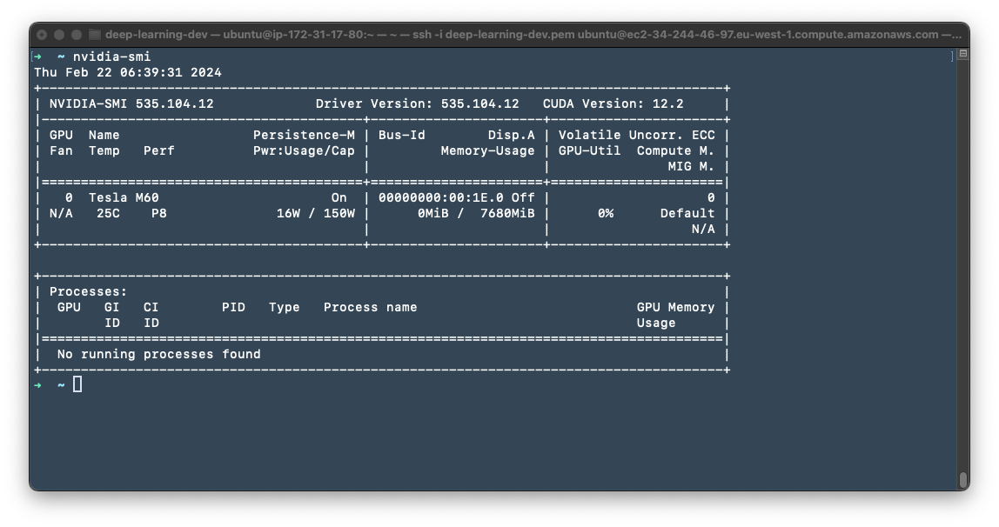

# Prepare EC2 Instance

Prepare EC2 instance development environment

Dependencies

- zsh & oh-my-zsh
- miniconda
- Docker
- MongoDB

## Updates

### Feb 22, 2024

Validated on AMI (`ami-062ce462f02565a76`) with `g3s.xlarge` instance type.

AMI `ami-062ce462f02565a76` info:

